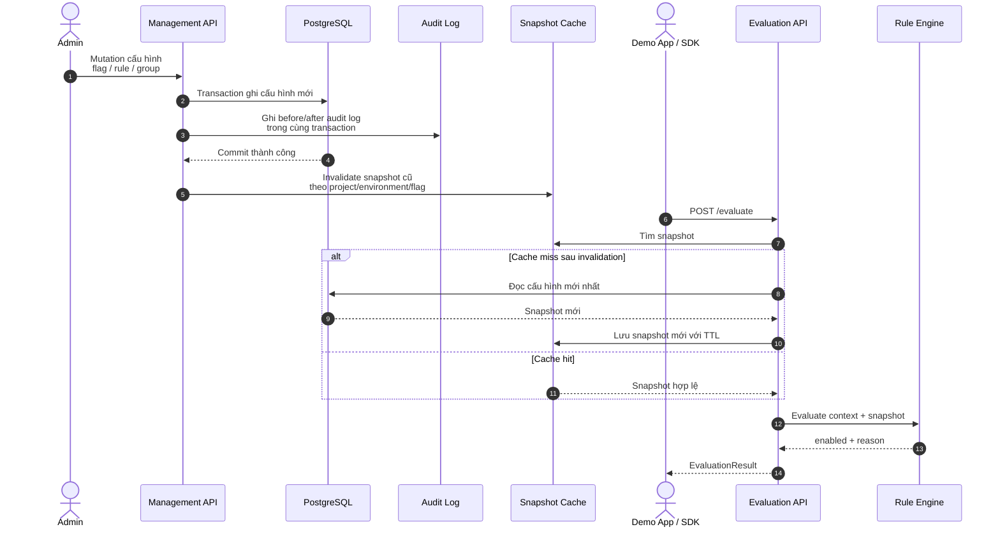

```mermaid
sequenceDiagram
    autonumber

    actor Admin as Admin
    participant API as Management API
    participant DB as PostgreSQL
    participant Audit as Audit Log
    participant Cache as Snapshot Cache
    actor App as Demo App / SDK
    participant Eval as Evaluation API
    participant Engine as Rule Engine

    Admin->>API: Mutation cấu hình<br/>flag / rule / group
    API->>DB: Transaction ghi cấu hình mới
    API->>Audit: Ghi before/after audit log<br/>trong cùng transaction
    DB-->>API: Commit thành công

    API->>Cache: Invalidate snapshot cũ<br/>theo project/environment/flag

    App->>Eval: POST /evaluate
    Eval->>Cache: Tìm snapshot

    alt Cache miss sau invalidation
        Eval->>DB: Đọc cấu hình mới nhất
        DB-->>Eval: Snapshot mới
        Eval->>Cache: Lưu snapshot mới với TTL
    else Cache hit
        Cache-->>Eval: Snapshot hợp lệ
    end

    Eval->>Engine: Evaluate context + snapshot
    Engine-->>Eval: enabled + reason
    Eval-->>App: EvaluationResult
```