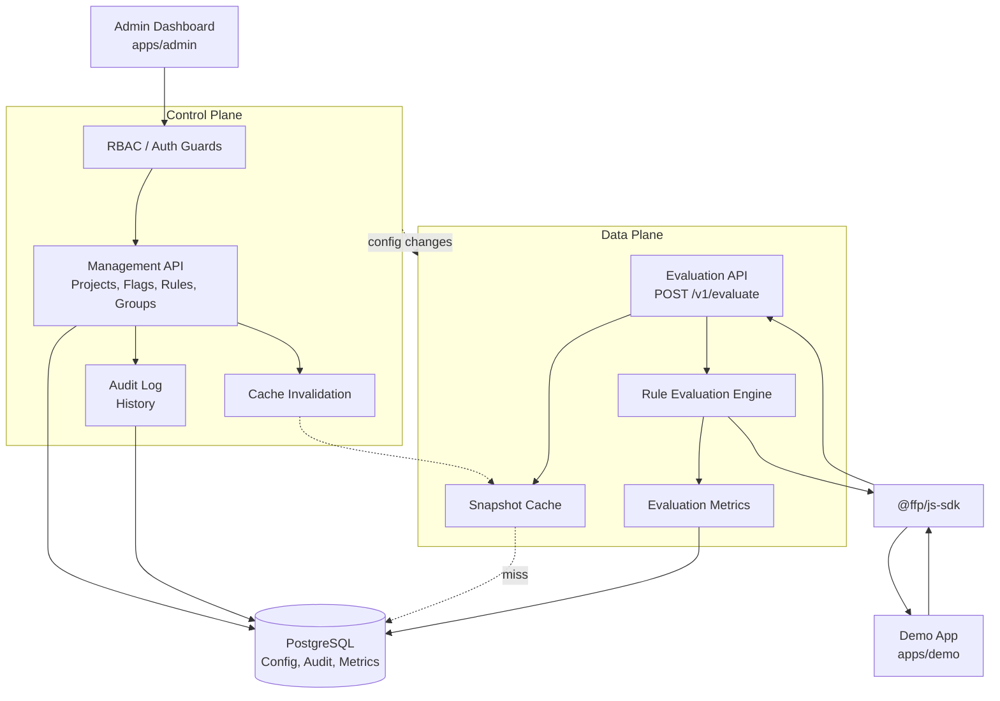

```mermaid
flowchart TD
    Admin["Admin Dashboard<br/>apps/admin"]
    Demo["Demo App<br/>apps/demo"]
    SDK["@ffp/js-sdk"]

    subgraph CP["Control Plane"]
        Auth["RBAC / Auth Guards"]
        Mgmt["Management API<br/>Projects, Flags, Rules, Groups"]
        Audit["Audit Log<br/>History"]
        Invalidate["Cache Invalidation"]
    end

    subgraph DP["Data Plane"]
        EvalAPI["Evaluation API<br/>POST /v1/evaluate"]
        Cache["Snapshot Cache"]
        Engine["Rule Evaluation Engine"]
        Metrics["Evaluation Metrics"]
    end

    DB[("PostgreSQL<br/>Config, Audit, Metrics")]

    Admin --> Auth --> Mgmt
    Mgmt --> DB
    Mgmt --> Audit --> DB
    Mgmt --> Invalidate -.-> Cache

    Demo --> SDK --> EvalAPI
    EvalAPI --> Cache
    Cache -. "miss" .-> DB
    EvalAPI --> Engine
    Engine --> Metrics --> DB
    Engine --> SDK --> Demo

    CP -. "config changes" .-> DP
```