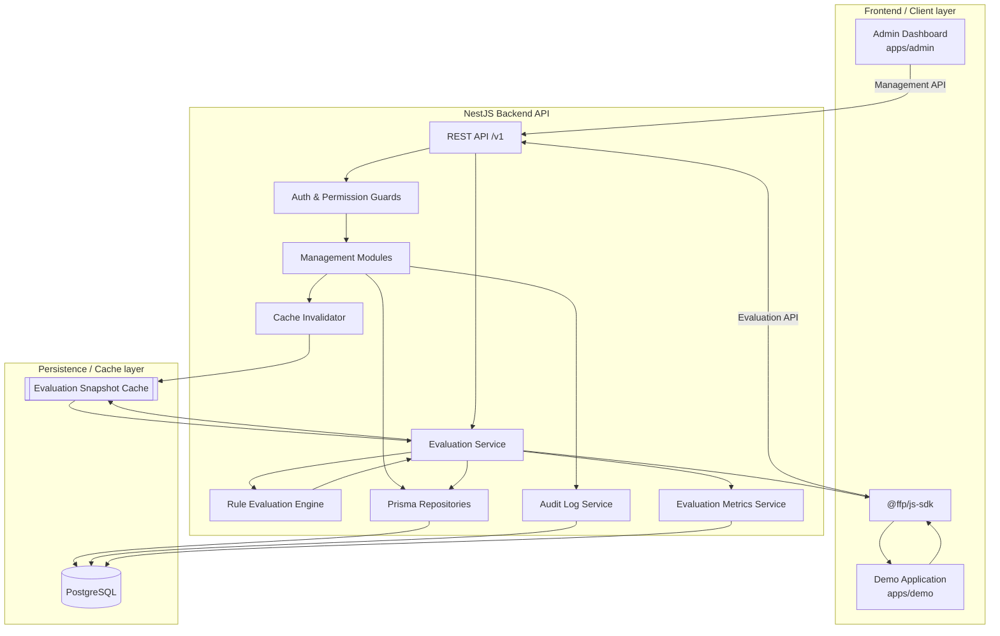

```mermaid
flowchart TB
    subgraph Clients["Frontend / Client layer"]
        Admin["Admin Dashboard<br/>apps/admin"]
        Demo["Demo Application<br/>apps/demo"]
        SDK["@ffp/js-sdk"]
    end

    subgraph Backend["NestJS Backend API"]
        API["REST API /v1"]
        Auth["Auth & Permission Guards"]
        Management["Management Modules"]
        EvalService["Evaluation Service"]
        Engine["Rule Evaluation Engine"]
        Audit["Audit Log Service"]
        Stats["Evaluation Metrics Service"]
        CacheInvalidator["Cache Invalidator"]
        Repositories["Prisma Repositories"]
    end

    subgraph Data["Persistence / Cache layer"]
        Postgres[("PostgreSQL")]
        Cache[["Evaluation Snapshot Cache"]]
    end

    Admin -->|"Management API"| API
    API --> Auth
    Auth --> Management

    Management --> Repositories
    Management --> Audit
    Management --> CacheInvalidator

    Repositories --> Postgres
    Audit --> Postgres
    CacheInvalidator --> Cache

    Demo --> SDK
    SDK -->|"Evaluation API"| API

    API --> EvalService
    EvalService --> Cache
    Cache --> EvalService

    EvalService --> Repositories
    EvalService --> Engine
    Engine --> EvalService

    EvalService --> Stats
    Stats --> Postgres

    EvalService --> SDK
    SDK --> Demo
```