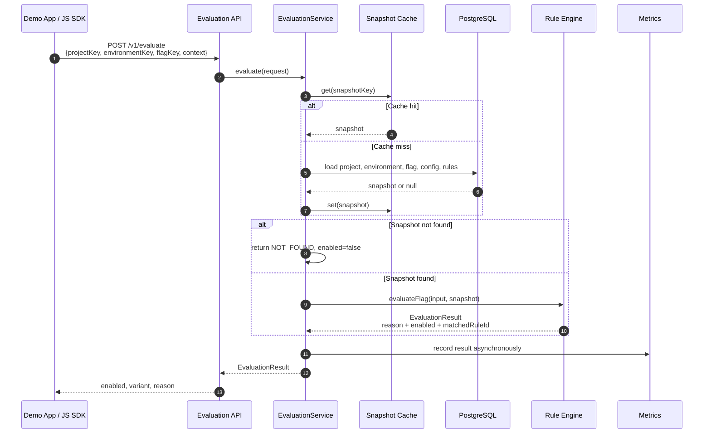

```mermaid
sequenceDiagram
    autonumber

    participant App as Demo App / JS SDK
    participant API as Evaluation API
    participant Service as EvaluationService
    participant Cache as Snapshot Cache
    participant DB as PostgreSQL
    participant Engine as Rule Engine
    participant Metrics as Metrics

    App->>API: POST /v1/evaluate<br/>{projectKey, environmentKey, flagKey, context}
    API->>Service: evaluate(request)

    Service->>Cache: get(snapshotKey)

    alt Cache hit
        Cache-->>Service: snapshot
    else Cache miss
        Service->>DB: load project, environment, flag, config, rules
        DB-->>Service: snapshot or null
        Service->>Cache: set(snapshot)
    end

    alt Snapshot not found
        Service->>Service: return NOT_FOUND, enabled=false
    else Snapshot found
        Service->>Engine: evaluateFlag(input, snapshot)
        Engine-->>Service: EvaluationResult<br/>reason + enabled + matchedRuleId
    end

    Service->>Metrics: record result asynchronously
    Service-->>API: EvaluationResult
    API-->>App: enabled, variant, reason
```