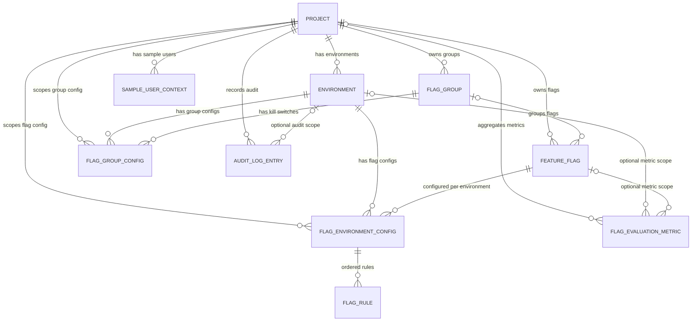

```mermaid
%%{init: {"themeVariables": {"fontSize": "13px"}}}%%
erDiagram
    %% ERD derived from apps/backend/prisma/schema.prisma.
    %% Compact version: only table names and relationships are shown.

    PROJECT ||--o{ ENVIRONMENT : "has environments"
    PROJECT ||--o{ FEATURE_FLAG : "owns flags"
    PROJECT ||--o{ FLAG_GROUP : "owns groups"
    PROJECT ||--o{ FLAG_GROUP_CONFIG : "scopes group config"
    PROJECT ||--o{ FLAG_ENVIRONMENT_CONFIG : "scopes flag config"
    PROJECT ||--o{ SAMPLE_USER_CONTEXT : "has sample users"
    PROJECT ||--o{ AUDIT_LOG_ENTRY : "records audit"
    PROJECT |o--o{ FLAG_EVALUATION_METRIC : "aggregates metrics"

    ENVIRONMENT ||--o{ FLAG_ENVIRONMENT_CONFIG : "has flag configs"
    ENVIRONMENT ||--o{ FLAG_GROUP_CONFIG : "has group configs"
    ENVIRONMENT |o--o{ AUDIT_LOG_ENTRY : "optional audit scope"
    ENVIRONMENT |o--o{ FLAG_EVALUATION_METRIC : "optional metric scope"

    FLAG_GROUP |o--o{ FEATURE_FLAG : "groups flags"
    FLAG_GROUP ||--o{ FLAG_GROUP_CONFIG : "has kill switches"

    FEATURE_FLAG ||--o{ FLAG_ENVIRONMENT_CONFIG : "configured per environment"
    FEATURE_FLAG |o--o{ FLAG_EVALUATION_METRIC : "optional metric scope"

    FLAG_ENVIRONMENT_CONFIG ||--o{ FLAG_RULE : "ordered rules"
```
