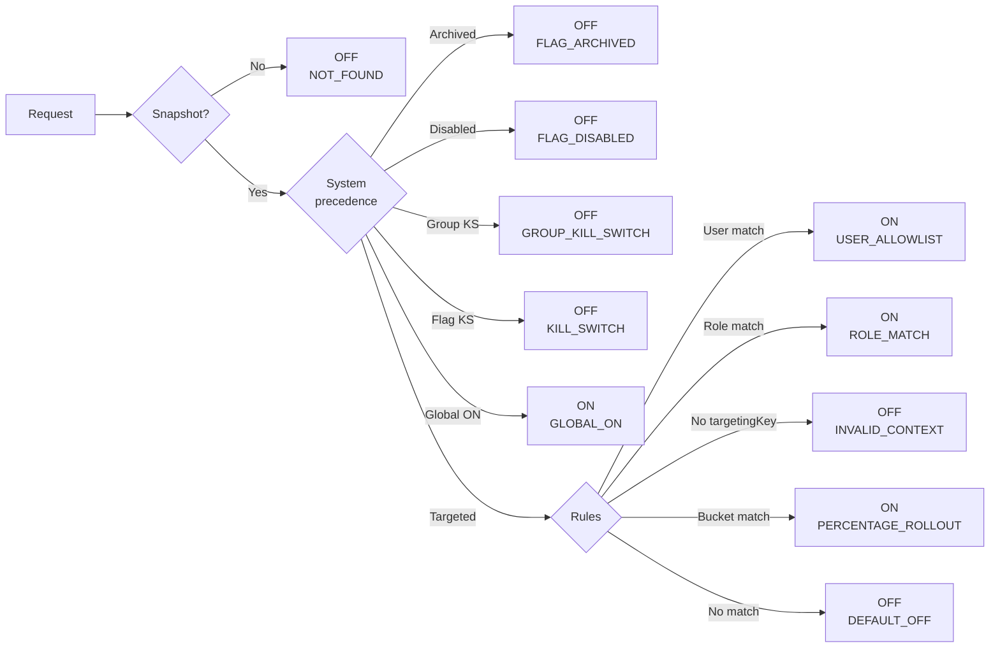

```mermaid
flowchart LR
    A[Request] --> B{Snapshot?}
    B -- No --> N[OFF<br/>NOT_FOUND]
    B -- Yes --> C{System<br/>precedence}

    C -- Archived --> A1[OFF<br/>FLAG_ARCHIVED]
    C -- Disabled --> A2[OFF<br/>FLAG_DISABLED]
    C -- Group KS --> A3[OFF<br/>GROUP_KILL_SWITCH]
    C -- Flag KS --> A4[OFF<br/>KILL_SWITCH]
    C -- Global ON --> A5[ON<br/>GLOBAL_ON]
    C -- Targeted --> D{Rules}

    D -- User match --> U[ON<br/>USER_ALLOWLIST]
    D -- Role match --> R[ON<br/>ROLE_MATCH]
    D -- No targetingKey --> I[OFF<br/>INVALID_CONTEXT]
    D -- Bucket match --> P[ON<br/>PERCENTAGE_ROLLOUT]
    D -- No match --> O[OFF<br/>DEFAULT_OFF]
```