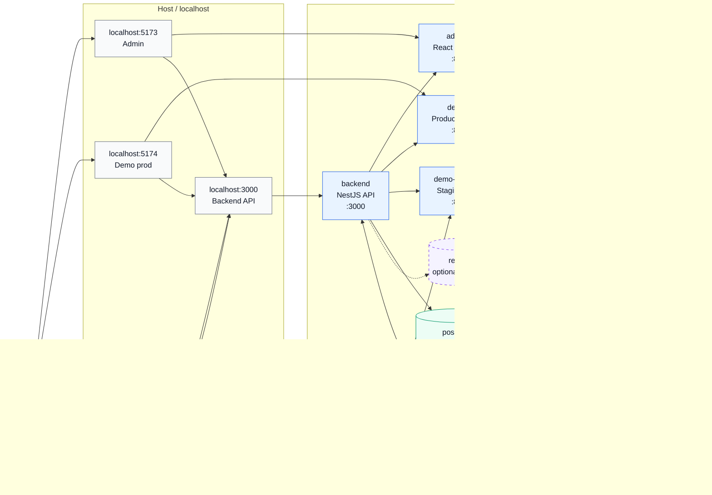

```mermaid
flowchart LR
    user["Browser"]

    subgraph host["Host / localhost"]
        hAdmin["localhost:5173<br/>Admin"]
        hDemo["localhost:5174<br/>Demo prod"]
        hDemoStg["localhost:5175<br/>Demo staging"]
        hApi["localhost:3000<br/>Backend API"]
        hStudio["localhost:5555<br/>Prisma Studio<br/>(optional)"]
    end

    subgraph compose["Docker Compose network"]
        postgres[("postgres<br/>PostgreSQL 16<br/>volume: postgres-data")]

        migrate["migrate<br/>Prisma migrate<br/>one-shot"]
        seed["demo-seed<br/>Seed data<br/>one-shot"]

        backend["backend<br/>NestJS API<br/>:3000"]

        admin["admin<br/>React + Nginx<br/>:80"]
        demo["demo<br/>Production env<br/>:80"]
        demoStg["demo-staging<br/>Staging env<br/>:80"]

        redis[("redis<br/>optional cache")]
        studio["prisma-studio<br/>optional tools"]
    end

    user --> hAdmin
    user --> hDemo
    user --> hDemoStg
    user --> hApi
    user -.-> hStudio

    hAdmin --> admin
    hDemo --> demo
    hDemoStg --> demoStg
    hApi --> backend
    hStudio -.-> studio

    postgres --> migrate --> seed --> backend
    backend --> admin
    backend --> demo
    backend --> demoStg

    backend --> postgres
    backend -.-> redis
    studio -.-> postgres

    hAdmin --> hApi
    hDemo --> hApi
    hDemoStg --> hApi

    classDef service fill:#E8F3FF,stroke:#2563EB,stroke-width:1px,color:#111827;
    classDef job fill:#FFF7ED,stroke:#EA580C,stroke-width:1px,color:#111827;
    classDef data fill:#ECFDF5,stroke:#059669,stroke-width:1px,color:#111827;
    classDef optional fill:#F5F3FF,stroke:#7C3AED,stroke-width:1px,stroke-dasharray:5 5,color:#111827;
    classDef host fill:#F9FAFB,stroke:#6B7280,stroke-width:1px,color:#111827;

    class backend,admin,demo,demoStg service;
    class migrate,seed job;
    class postgres data;
    class redis,studio optional;
    class hAdmin,hDemo,hDemoStg,hApi,hStudio host;
```