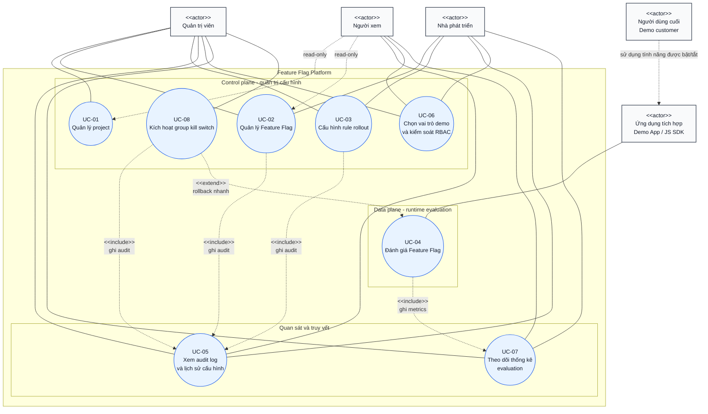

```mermaid
%%{init: {"themeVariables": {"fontSize": "14px"}}}%%
flowchart TD
    %% Use case model diagram derived from the current implementation:
    %% - Backend controllers: apps/backend/src/**/*controller.ts
    %% - Admin dashboard routes/API: apps/admin/src/App.tsx, apps/admin/src/lib/api.ts
    %% - Demo RBAC: apps/backend/src/auth/permission-matrix.ts, apps/admin/src/auth/model.ts
    %% - Demo app and SDK: apps/demo/src/App.tsx, packages/js-sdk/src/client.ts

    Admin["&lt;&lt;actor&gt;&gt;<br/>Quản trị viên"]
    Dev["&lt;&lt;actor&gt;&gt;<br/>Nhà phát triển"]
    Viewer["&lt;&lt;actor&gt;&gt;<br/>Người xem"]
    Client["&lt;&lt;actor&gt;&gt;<br/>Ứng dụng tích hợp<br/>Demo App / JS SDK"]
    EndUser["&lt;&lt;actor&gt;&gt;<br/>Người dùng cuối<br/>Demo customer"]

    subgraph System["Feature Flag Platform"]
        direction TB

        subgraph CP["Control plane - quản trị cấu hình"]
            direction TB
            UC01(("UC-01<br/>Quản lý project"))
            UC02(("UC-02<br/>Quản lý Feature Flag"))
            UC03(("UC-03<br/>Cấu hình rule rollout"))
            UC06(("UC-06<br/>Chọn vai trò demo<br/>và kiểm soát RBAC"))
            UC08(("UC-08<br/>Kích hoạt group kill switch"))
        end

        subgraph OBS["Quan sát và truy vết"]
            direction TB
            UC05(("UC-05<br/>Xem audit log<br/>và lịch sử cấu hình"))
            UC07(("UC-07<br/>Theo dõi thống kê<br/>evaluation"))
        end

        subgraph DP["Data plane - runtime evaluation"]
            direction TB
            UC04(("UC-04<br/>Đánh giá Feature Flag"))
        end
    end

    Admin --- UC01
    Admin --- UC02
    Admin --- UC03
    Admin --- UC05
    Admin --- UC06
    Admin --- UC07
    Admin --- UC08

    Dev --- UC02
    Dev --- UC03
    Dev --- UC05
    Dev --- UC06
    Dev --- UC07

    Viewer -. "read-only" .-> UC01
    Viewer -. "read-only" .-> UC02
    Viewer --- UC05
    Viewer --- UC06
    Viewer --- UC07

    Client --- UC04
    EndUser -. "sử dụng tính năng được bật/tắt" .-> Client

    UC02 -. "&lt;&lt;include&gt;&gt;<br/>ghi audit" .-> UC05
    UC03 -. "&lt;&lt;include&gt;&gt;<br/>ghi audit" .-> UC05
    UC08 -. "&lt;&lt;include&gt;&gt;<br/>ghi audit" .-> UC05
    UC04 -. "&lt;&lt;include&gt;&gt;<br/>ghi metrics" .-> UC07
    UC08 -. "&lt;&lt;extend&gt;&gt;<br/>rollback nhanh" .-> UC04

    classDef actor fill:#F9FAFB,stroke:#374151,stroke-width:1.4px,color:#111827;
    classDef usecase fill:#E8F3FF,stroke:#2563EB,stroke-width:1.2px,color:#111827;
    classDef boundary fill:#FFFFFF,stroke:#9CA3AF,stroke-width:1px,color:#111827;

    class Admin,Dev,Viewer,Client,EndUser actor;
    class UC01,UC02,UC03,UC04,UC05,UC06,UC07,UC08 usecase;
```
